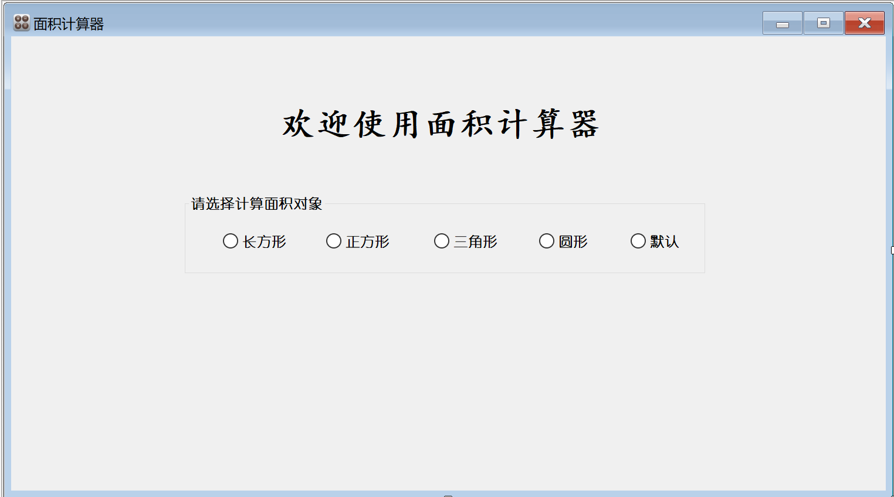

# Table of Contents
* Project Title
* Getting Started
* Running the tests
* Usage
* Contributing
* Versioning
* Authors
* License
* Acknowledgments
  
# Project Title
## Area-Calculator
This project is an area-calculator, which can calculate the area of squares, rectangles, triangles and circles. It can support the input of centimeter and inch units, and the results of the calculation can be automatically converted into the square centimeter.

# Getting Started
Before you start using Area-Calculator, you have to make it available on your computer. Just click on the ZIP file and you can download the area calculator.

# Running the tests
Before using the project, you can try to enter simple graphical data and compare the results with the correct results. If the output is correct, the project test is successful.

# Usage

First, select the calculated area object on the initial page.

Then you are prompted to enter the underlying data for the calculated object you want.

Finally, the area calculator can automatically determine the area of the object.

# Contributing
This project exists thanks to all the people who contribute.
* August
* Justin
* Amon
* Wilson
* Jake Yan
  
# Versioning
This is the initial version of the area calculator, and a more complete version may follow.

# Authors
August led the team to complete the project.

# License
Copyright © 2022 <Feng Xiong>

Permission is hereby granted, free of charge, to any person obtaining a copy of this software and associated documentation files (the “Software”), to deal in the Software without restriction, including without limitation the rights to use, copy, modify, merge, publish, distribute, sublicense, and/or sell copies of the Software, and to permit persons to whom the Software is furnished to do so, subject to the following conditions:

The above copyright notice and this permission notice shall be included in all copies or substantial portions of the Software.

THE SOFTWARE IS PROVIDED “AS IS”, WITHOUT WARRANTY OF ANY KIND, EXPRESS OR IMPLIED, INCLUDING BUT NOT LIMITED TO THE WARRANTIES OF MERCHANTABILITY, FITNESS FOR A PARTICULAR PURPOSE AND NONINFRINGEMENT. IN NO EVENT SHALL THE AUTHORS OR COPYRIGHT HOLDERS BE LIABLE FOR ANY CLAIM, DAMAGES OR OTHER LIABILITY, WHETHER IN AN ACTION OF CONTRACT, TORT OR OTHERWISE, ARISING FROM, OUT OF OR IN CONNECTION WITH THE SOFTWARE OR THE USE OR OTHER DEALINGS IN THE SOFTWARE.

# Acknowledgments
Thank you for using the area calculator we developed. Wish you a nice experience.